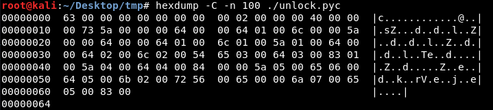
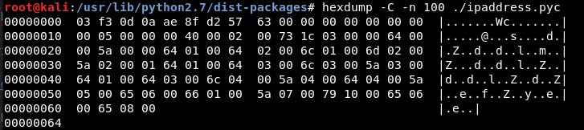

# PyLock (PE Reversing)
> Do mình không chuẩn bị tốt nên bài re này mình không làm được (Một phần mình chưa gặp bao giờ + Kĩ năng google kém). Dù có writeup về bài này rồi no thôi mình viết lại luyện kĩ năng tý.
## File analysis
unlock.exe: PE32+ executable (console) x86-64, for MS Windows

Một bài 'key validation'. Sau khi cho vào IDA thì disassembly code của nó khá chi là "không đọc được".
Nếu để ý tên file cũng như gợi ý thì có thể đoán exe này được viết = python và cần phải convert nó về python code.(Dĩ nhiên mình có thể kết luận vậy bởi vì mh vừa ms làm 1 bài python-packed exe trên ctftime)

Câu hỏi là nếu chưa gặp bao giờ + nó được pack bằng ngôn ngữ khác thì sao?

Ta sẽ sử dụng [Binwalk](https://github.com/ReFirmLabs/binwalk) để truy vết signature trên binary:

`binwalk unlock.exe # view signatures `

`binwalk -e unlock.exe # write signatures to a folder`

Sau khi kiểm tra các files trong folder có những loại sau:
* XML 1.0 document, ASCII text
* PE32+ executable (DLL) (GUI)
* zlib compressed data
* python 2.7 byte-compile and more

Rõ ràng là compiled python là cái ta quan tâm nhất. Ta thử decompile with [Uncompyle6](https://github.com/rocky/python-uncompyle6) xem có gì không.

Qua kiểm tra thì chủ yếu là code python của thư viện nào đó. No mà nếu để ý tên module __c:\python27\Lib\site-packages\PyInstaller\loader\pyimod01_os_path.py__ thì some search google kết luận được rằng PyInstaller là lib pack .py -> .exe

Oke. Mình đã biết file bắt nguồn từ đâu @@

## Doing Reverse

Google "How to reverse PyInstaller binary" sẽ cho biết các bước làm ([one Instance](https://reverseengineering.stackexchange.com/questions/160/how-do-you-reverse-engineer-an-exe-compiled-with-pyinstaller)).

1. __Use pyi-archive_viewer to extract unlock and PyLock in PYZ-00.pyz__
2. __Vì extracted pyc bị mất file signature.__

Đây là unlock lúc mới extract:



Một file .pyc hoàn chỉnh:



=)) Ta pải patch 8 bytes "03 f3 0d 0a ae 8f d2 57"

3. __Use uncompyle6 to decompile these .pyc files__

Kết quả ta được:

unlock.py

```javascript
# uncompyle6 version 3.2.4
# Python bytecode 2.7 (62211)
# Decompiled from: Python 2.7.15 (default, Jul 28 2018, 11:29:29)
# [GCC 8.1.0]
# Embedded file name: unlock.py
# Compiled at: 2018-11-22 19:12:22
import sys, os
from PyLock import *
KEY = raw_input('License key: ')
def main():
    locker = PyLock('# A long decoded string')
    locker.unlock(XorLock, 'thi')
    exec locker.script
if __name__ == '__main__':
    sys.exit(main())
# okay decompiling final.pyc
```

PyLock.py
```python
# uncompyle6 version 3.2.4
# Python bytecode 2.7 (62211)
# Decompiled from: Python 2.7.15 (default, Jul 28 2018, 11:29:29)
# [GCC 8.1.0]
# Embedded file name: /root/Desktop/tmp/PyLock.py
# Compiled at: 2018-11-22 19:29:31
import sys, os
from itertools import cycle, izip
import base64

class XorLock:

    def __init__(self):
        pass

    def encode(self, script, key):
        encoded = ('').join((chr(ord(c) ^ ord(k)) for c, k in izip(script, cycle(key))))
        return base64.b64encode(encoded)

    def decode(self, script, key):
        script = base64.b64decode(script)
        return ('').join((chr(ord(c) ^ ord(k)) for c, k in izip(script, cycle(key))))


class PyLock:

    def __init__(self, script):
        self.script = script
        self.keys = []

    def run(self):
        exec self.script

    def save(self):
        return self.script

    def lock(self, Locker, key):
        locker = Locker()
        self.script = locker.encode(self.script, key)
        self.keys.append([Locker.__name__, key])

    def unlock(self, Locker, key):
        locker = Locker()
        self.script = locker.decode(self.script, key)
# okay decompiling PyLock.pyc

```

Sau khi phân tích thì "# A long decoded string" được base64 decoded.
In unlock.py sau khi decode ta được 1 script mới gần như giống y xì ở unlock.py chỉ thay đổi decoded string và key.

=)) Chương trình decode -> execute script -> ... until "script checking key" thì thôi

Và đây là script cuối cùng:

```python
import sys, os

# KEY = '104898840'
# KEY = '9492093'
# KEY = '6905729518'

KEY = raw_input('License key: ')

def main():
	try:
		key = int(KEY)
		if (key == 404982000012063942418231892259):
			print('Congratulation! Your flag is ...')
			flag = ['A']
			i = 1
			while(i < key):
				idx = len(flag)
				while(idx):

					l = flag[idx-1]
					if (l == 'Z'):
						flag[idx-1] = 'A'
						idx -= 1
						continue
					else:
						flag[idx-1] = chr(ord(l) + 1)
						break
				if (not idx):
					flag = ['A'] + flag
				i += 1
			flag = ''.join(flag)
			print('SVATTT2018{' + flag + '}')
		else:
			print('Wrong key!')
	except Exception as e:
		print(e)
		print('Invalid key!')
	return

if __name__ == "__main__":
	sys.exit(main())
```

Mình đọc code không tốt nên lúc đầu đọc không hiểu CT làm gì. sau khi chạy thì ms hiểu được:


=)) chuyển base 10 =)) base 26 (digits: [A -> Z])

Đoạn code cuối cùng đây:
```python
def toBase(num, base):
    ls = []
    while(num > 0):
        mod = num % base
        num = num / base
        ls.append(mod)
    ls.reverse()
    return ls
if __name__ == "__main__":
    flag = toBase(404982000012063942418231892259, 26)
    flag = "".join([chr(i + 0x40) for i in flag])
    print flag
```
